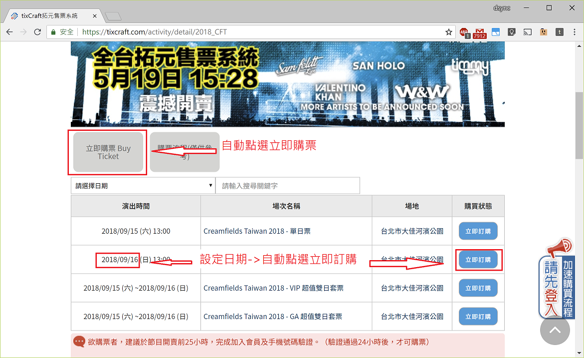
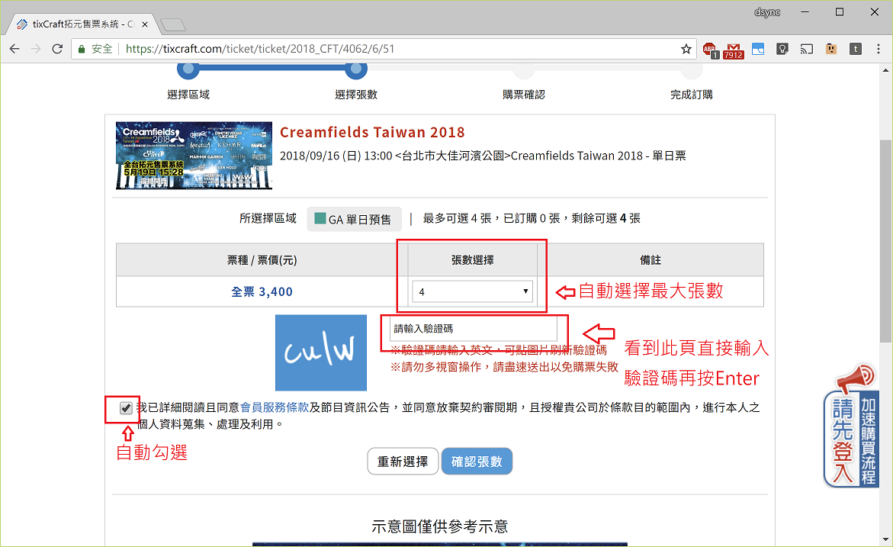
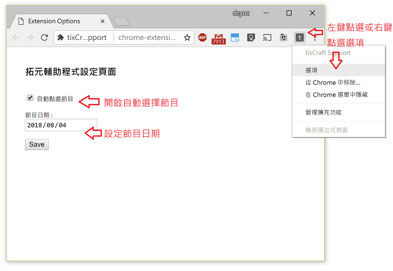

# 拓元輔助程式

## 說明
1. 自動點選"立即購票"，顯示節目列表。
2. 在節目列表中，自動尋找節目日期並點選"立即訂購"。

3. 手動選擇座位 (自動隱藏已售完區域)
4. 自動選擇最大張數與勾選同意條款，並準備好輸入驗證碼，輸入完按Enter。

PS. 玉山信用卡頁面自動填入前六碼，其他家不支援。

## 設定
1. 左鍵或右鍵點選拓元輔助ICON，右鍵要選擇選項。
2. 點選日期
3. 可以設定購買張數

## 驗證碼
拓元驗證碼解說與練習 [外部網站](https://goo.gl/NUk68T)
